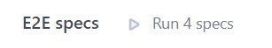

# RS-School-React2023

### Run in dev mode locally

1. Install all dependencies in root directory 

```npm i```

2. Run application in dev mode

```npm run dev```

### Run build locally

1. Run build command

```npm run buildAll```

2. Run preview command

```npm run preview```

### Run vitest test with coverage

```npm run coverage```

### Run e2e test in Cypress App with coverage

1. Run test

```npm run cy:start-open```

2. To view full test coverage after test ends click on "Run 4 specs" button



### Run e2e test in console

```npm run cy:start-run```
